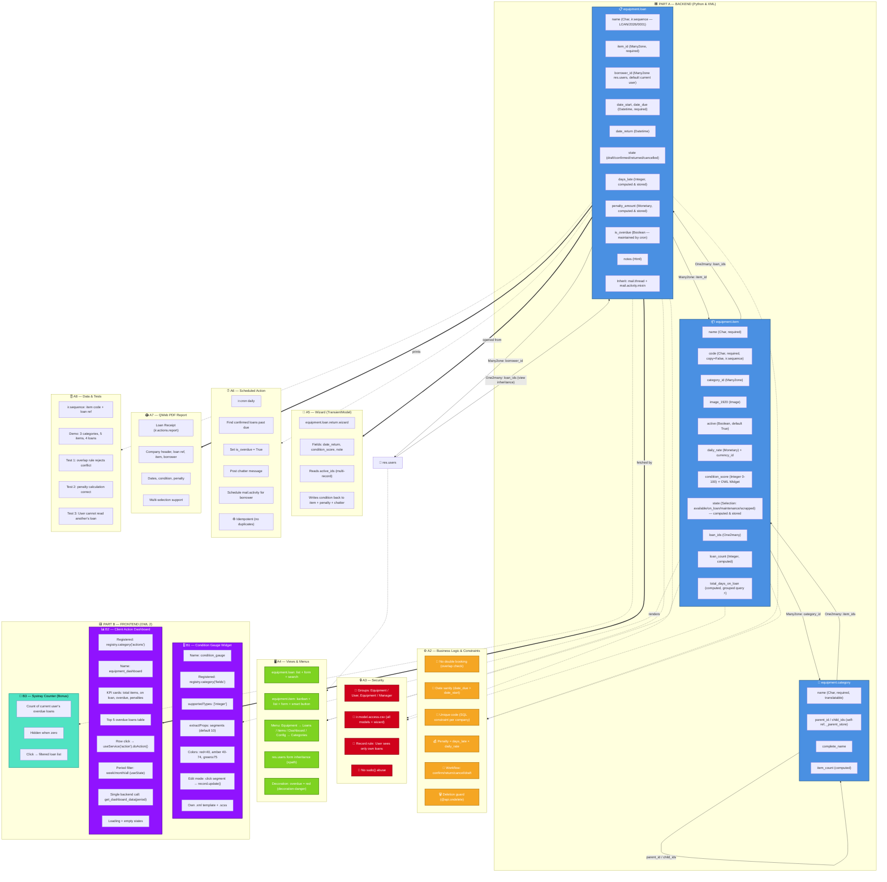

# Porcelia — Equipment Loan Manager

Odoo 19 addon for borrowing, tracking and returning company equipment, with a
daily penalty for every day a loan comes back late.

| | |
|---|---|
| Repository | <https://github.com/Ahmed-Samy-Omran/porcelia_equipment_loan_odoo19> |
| Default branch | `main` |
| Module location | repository root (`porcelia_equipment_loan/`) |
| Odoo | 19.0 (`version_info = (19, 0, 0, FINAL, 0)`) |
| Module version | `19.0.1.0.0` |
| Depends on | `base`, `mail` |
| License | LGPL-3 |
| Assets | none — no JavaScript bundle, no build step |

The module **is** the repository root, so the checkout directory has to be named
`porcelia_equipment_loan` for Odoo to find it.

---

## What it does

- **Categories** — a three-level tree (`parent_id`, `_parent_store`) with a
  recursive `complete_name` ("Electronics / Computers / Laptops") and an
  item counter.
- **Items** — code from a sequence (`EQ/2026/0001`), category, image, condition
  score 0–100, daily rate, manual *maintenance* / *scrapped* flags, and a computed
  `state` (`available`, `on_loan`, `maintenance`, `scrapped`).
- **Loans** — reference from a sequence (`LOAN/2026/0001`), item, borrower,
  start/due/return dates, chatter, activities and a PDF receipt.
- **Business rules** — no double booking of an item, `date_due > date_start`, a
  returned loan must have a return date, penalty = days late × daily rate, and a
  deletion guard.
- **Security** — two groups (Equipment / User, Equipment / Manager) under a new
  `res.groups.privilege`; a user only ever sees their own loans.
- **Daily cron** — flags confirmed loans that are past due, posts a message and
  schedules a reminder on the borrower, without duplicating anything on re-runs.
- **Return wizard** — returns several loans at once, and writes the condition
  score back onto the item.
- **QWeb PDF report** — a loan receipt, printable on several loans at once.

---

## Architecture



**How to read it against the code**

| Diagram | Reality |
|---|---|
| B1, B2, B3 (Part B) | **Not implemented.** `static/src/` holds only a `.gitkeep` — there is no OWL widget, no `equipment_dashboard` client action and no systray. |
| `IT7 condition_score` | Real field, but a plain `Integer` with a 0–100 check, not a custom OWL widget. |
| `LN7 days_late`, `LN8 penalty_amount` | Computed **on the fly**, not stored. `duration_days` is the stored one. |
| `V3` menus | Equipment → Loans, Items, and Configuration → Categories (managers only). No Dashboard entry. |
| `A8 D2` demo data | The current `data/equipment_demo.xml` holds 15 categories, 17 items and 12 loans; the counts in the diagram are the original smaller set. |
| `S4 no sudo()` | True: every aggregate (`item_count`, `loan_count`, `total_days_on_loan`, `equipment_loan_count`) goes through the record rules, so no `sudo()` is used to make a count leak. |

---

## Installation

Requirements: Odoo 19.0 source, PostgreSQL, and a Python 3.10+ environment with
Odoo's dependencies.

**1. Put the module in an addons path**

```bash
git clone https://github.com/Ahmed-Samy-Omran/porcelia_equipment_loan_odoo19.git \
    /path/to/odoo/addons/porcelia_equipment_loan
```

**2. Install it on a database**

```bash
/path/to/venv/bin/python /path/to/odoo/odoo-bin \
    -d my_database \
    --db_host=localhost --db_user=<user> --db_password=<password> \
    --addons-path=/path/to/odoo/addons,/path/to/odoo/odoo/addons \
    -i porcelia_equipment_loan \
    --without-demo=False \
    --stop-after-init
```

`--without-demo=False` is what loads `data/equipment_demo.xml`. Drop it for an
empty database. To change the module later, use `-u porcelia_equipment_loan`.

**3. Run the server and log in**

```bash
/path/to/venv/bin/python /path/to/odoo/odoo-bin -d my_database \
    --db_host=localhost --db_user=<user> --db_password=<password> \
    --addons-path=/path/to/odoo/addons,/path/to/odoo/odoo/addons
```

Open the web interface (Odoo's default port is `8069`), log in, and the app
appears under **Apps**. The **Equipment** menu is then available: Loans, Items,
and Configuration → Categories (managers only).

**4. Groups**

`Settings → Users → Equipment` offers two groups: **User** (read categories and
items, create loans, see only their own loans) and **Manager** (full
create/write/delete, sees every loan). Managers imply Users.

**5. Daily job**

`ir.cron` record *Equipment: Flag Overdue Loans* is created on install and runs
every day. In a fresh database it is enabled automatically; if your deployment
disables new cron records, switch it on in **Settings → Technical → Scheduled
Actions**.

---

## Running the tests

The suite is a single `TransactionCase` class of 32 tests in
`tests/test_equipment_loan.py`. This is the exact command used for the last run:

```bash
/home/ahmed-omran/projects/odoo19/odoo19-venv/bin/python \
    /home/ahmed-omran/projects/odoo19/odoo/odoo-bin \
    -d porcelia_sb_check2 \
    --db_host=localhost --db_user=odoo19 --db_password=<password> \
    --addons-path=/home/ahmed-omran/projects/odoo19,/home/ahmed-omran/projects/odoo19/odoo/odoo/addons \
    --test-tags /porcelia_equipment_loan \
    --stop-after-init
```

Result of that run — the module suite, 32 tests, all green:

```
odoo.tests.result: 0 failed, 0 error(s) of 32 tests when loading database 'porcelia_sb_check2'
```

> `--db_password` was the local development password; it is replaced by
> `<password>` above on purpose so no credential lands in the repository.
> The database name `porcelia_sb_check2` is a throwaway created for the run —
> any database works, it just has to exist with the module installed.

The database used for that run was created with demo data, so install it first:

```bash
# same odoo-bin call as in step 2, plus:
    --without-demo=False
```

**Lint** (Odoo's own configuration, `ruff check` only):

```bash
/home/ahmed-omran/projects/odoo19/odoo19-venv/bin/python -m ruff check \
    --config /home/ahmed-omran/projects/odoo19/odoo/ruff.toml .
```

```
All checks passed!
```

### What the 32 tests cover

Overlap rejection, touching periods allowed, draft loans not blocking, date
order, penalty (late, early, on time, still-open overdue), security (own loan
only, manager sees all, no read/delete for a user on someone else's record),
workflow transitions and forbidden ones, item state tracking and the
maintenance/scrapped precedence, the return wizard (multi, non-confirmed,
return before start), the cron (runs once, no duplicate activity, ignores
returned loans), sequences (unique item codes, loan references), aggregates in a
single query, and the report (renders every selected loan, forbidden on
another user's loan).

---

## What was completed, and what was skipped

### Completed

| Area | Notes |
|---|---|
| Models, workflow, overlap rule, penalties | `models/` |
| Hierarchical categories, item state, aggregates | computed fields use `_read_group`, one query per recordset |
| Security | 2 groups in a `res.groups.privilege`, 8 ACL rows, 2 record rules |
| Return wizard | `wizard/`, multi-record |
| Daily cron | idempotent, posts a message and one activity |
| QWeb PDF report | multi-document |
| Sequences, cron record, demo data | `data/` |
| Views and menus | kanban / list / form / search, two smart buttons, `res.users` inheritance |
| Tests | 32 passing, `ruff check` clean |
| `action_view_items` / `action_view_loans` / `action_view_equipment_loans` | all three return their XML action through `self.env.ref()` and only set `domain` and `context` |

### Deliberately skipped

| Skipped | Why |
|---|---|
| **OWL condition gauge** (B1) | The original request was for a backend module. The `condition_score` field is a plain integer with a 0–100 check, which is enough to run and test the module. |
| **Dashboard client action** (B2) | Same reason: it needs a `get_dashboard_data` ORM method, an OWL component and a menu entry. None of that was asked for. |
| **Systray counter** (B3) | Marked as a bonus in the design; skipped for the same reason. |
| **Screenshots / GIF** | There is nothing to capture for B1 and B2, because they do not exist. See below. |
| **`static/` assets** | Empty on purpose — the module has no JavaScript, so there is no bundle to build. |
| **Demo users' passwords** | The demo data sets `demo` as the password for the three demo users; they exist for the demo only. |
| **Icons** | `static/description/icon.png` is not committed. |

### Known limitations

- `item_count` counts the items filed **directly** in a category, not the whole
  subtree, even though the field comment says "and its children categories".
- `days_late` / `penalty_amount` are computed for any loan with a due date in
  the past, so a **cancelled** loan that was never returned shows a penalty.
- Any new kanban view must use the Odoo 19 syntax
  (`<templates><t t-name="card">`); the pre-17 syntax loads without an error and
  only fails at render time with `Missing 'card' template`.
- No `LICENSE` file is committed, although the manifest declares `LGPL-3`.

---

## Screenshots

**None, and here is why.** The two screenshots this README was supposed to carry
are the condition gauge widget and the dashboard — both of which are **not
implemented** (see *Deliberately skipped*). Publishing a mock-up or a
screenshot of a mock-up would misrepresent the repository, so the section is
empty on purpose.

To fill it in, the OWL work has to exist first, then the UI can be captured on a
running instance (the module has no assets today, so an asset build step and a
headless browser tool would be needed as well).

---

## Assumptions

These were not specified in the request; they are the readings this
implementation went with.

1. **Touching loan periods are allowed.** A loan ending 10/01 and another
   starting 10/01 do not overlap. A stricter reading (day-granularity) would
   forbid it.
2. **Only `confirmed` loans block an item.** Drafts and cancelled loans are
   ignored by the overlap check and are not counted in `loan_count` or the item
   state.
3. **Penalty is a flat daily rate**, taken from the item and its currency, and
   uses the same rounding as `days_late` (`ceil`, so a partial day counts as a
   full one). The item has no separate penalty rate.
4. **`is_overdue` is owned by the cron**, never set by hand. It is a flag for
   "the daily job has seen this", not the source of truth for lateness, which is
   why the list view's *Overdue* filter is `is_overdue = True` while the penalty
   is computed from the dates.
5. **A user only sees their own loans.** That is enforced by a group record rule
   rather than by a field-level check, so any new view on `equipment.loan` is
   protected automatically — including the aggregates, which is why they use no
   `sudo()`.
6. **Deletion is blocked on loans except in `draft` and `cancelled`**, and the
   item is protected by `ondelete="restrict"` on the loans.
7. **Demo dates are nudged by five minutes.** `days_late` and `duration_days`
   round up while each field calls `now()` on its own, so a span of exactly four
   days would report five. The demo data shifts the last date of each loan by
   five minutes so the spans land just under a whole number of days.
8. **The module is the repository root**, not a subdirectory, and is therefore
   named `porcelia_equipment_loan` (Odoo needs that name to load it).

---

## Repository layout

```
porcelia_equipment_loan/
├── __manifest__.py                     19.0.1.0.0, application, depends on base + mail
├── models/
│   ├── equipment_category.py           tree, complete_name, item_count, action_view_items
│   ├── equipment_item.py               code/state/condition, aggregates, action_view_loans
│   ├── equipment_loan.py               workflow, overlap rule, penalty, cron
│   └── res_users.py                    equipment_loan_count + action_view_equipment_loans
├── wizard/
│   ├── equipment_loan_return_wizard.py
│   └── equipment_loan_return_wizard_views.xml
├── security/
│   ├── equipment_groups.xml            res.groups.privilege + 2 groups
│   ├── ir.model.access.csv             8 access lines
│   └── equipment_record_rules.xml      own loans / every loan
├── views/                              item, category, loan, menus, res.users
├── report/ir_actions_report.xml        Loan Receipt (QWeb PDF)
├── data/
│   ├── equipment_sequence_data.xml     2 sequences + the daily cron
│   └── equipment_demo.xml              demo categories, items, users, loans
├── static/src/.gitkeep                 empty on purpose
└── tests/test_equipment_loan.py        32 tests
```

## Author

Porcelia — Technical Team.
