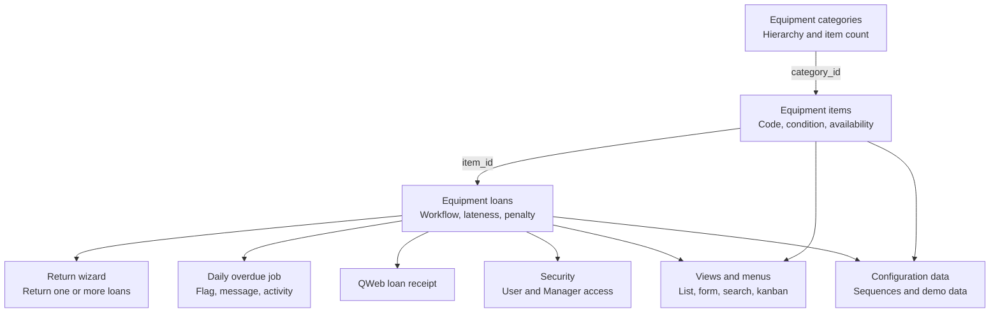

# Porcelia Equipment Loan Manager

An Odoo 19 module for lending company equipment, tracking its return, and
following up on overdue loans.

| Project detail | Value |
| --- | --- |
| Repository | <https://github.com/Ahmed-Samy-Omran/porcelia_equipment_loan_odoo19> |
| Default branch | `main` |
| Module location | Repository root |
| Odoo version | 19.0 |
| Module name | `porcelia_equipment_loan` |
| License | LGPL-3 |

## What I completed

The backend part of the project is complete.

- **Data model and relations (A1):** hierarchical equipment categories, items,
  loans, user loan counters, sequences, and company-aware item codes.
- **Business logic and constraints (A2):** loan workflow, overlap prevention,
  date validation, condition-score range validation, late-day and penalty
  calculations, and safe deletion rules.
- **Security (A3):** Equipment User and Equipment Manager groups, access rights,
  and record rules so ordinary users can access only their own loans.
- **Views and menus (A4):** item kanban/list/form views, loan list/form/search
  views, categories, menus, smart buttons, and the user-form extension.
- **Wizard, report, and cron (A5–A7):** a multi-loan return wizard, a QWeb PDF
  loan receipt, and a daily overdue-loan reminder job.
- **Arabic interface:** Arabic translations for the module are provided in
  `i18n/ar.po`.

## Backend map



## ما لحقتش بسبب الوقت بس هتعلمها واعملها

| Item | Why it is not included yet |
| --- | --- |
| **OWL condition gauge (B1)** | `condition_score` is implemented as a regular integer field with a database check from 0 to 100. I did not build the custom OWL field widget. |
| **OWL dashboard (B2)** | I did not add a client action, dashboard data endpoint, or menu entry. |
| **Systray overdue counter (B3)** | This was a bonus frontend feature and was not implemented. |

All three are frontend features that I ran out of time for. I plan to learn
them and add them later.

## Arabic interface

The module includes an Arabic translation file at `i18n/ar.po`. It translates
the module's menus, labels, buttons, workflow messages, and report text.

To use it, activate Arabic from **Settings → Translations → Languages**, then
set Arabic as the user's language. Upgrade the module after translation-source
changes so Odoo imports the latest entries.

## Installation

1. Clone the repository into an Odoo addons path:

   ```bash
   git clone https://github.com/Ahmed-Samy-Omran/porcelia_equipment_loan_odoo19.git \
       /path/to/odoo/addons/porcelia_equipment_loan
   ```

2. Install the module. This command also loads the demo data:

   ```bash
   /path/to/venv/bin/python /path/to/odoo/odoo-bin \
       -d my_database \
       --db_host=localhost --db_user=<user> --db_password=<password> \
       --addons-path=/path/to/odoo/addons,/path/to/odoo/odoo/addons \
       -i porcelia_equipment_loan \
       --without-demo=False \
       --stop-after-init
   ```

3. Start Odoo normally with the same addons path, log in, and open the
   **Equipment** app. Managers can manage categories; users can work with items
   and their permitted loans.

To apply later source changes, replace `-i` with `-u porcelia_equipment_loan`.

## Tests

The module ships a test suite in `tests/test_equipment_loan.py`. It is run
automatically on install and update, and it covers the following areas:

| Area | What the tests check |
| --- | --- |
| **Booking overlap** | Two confirmed loans cannot overlap, and touching periods are still allowed. Draft loans do not block an item. |
| **Date validation** | The due date must be after the start date. |
| **Lateness and penalty** | Late returns produce a penalty, while early and on-time returns do not, and an open overdue loan keeps reporting its current lateness. |
| **Workflow** | Draft, confirm, return, cancel, and reset transitions, including the transitions that must be refused. |
| **Deletion rules** | Only draft or cancelled loans can be deleted, and a regular user cannot delete a loan or an item. |
| **Item state** | The item state follows confirmed unreturned loans, and maintenance or scrapping wins over them. |
| **Security** | A user can read only their own loans, a manager sees all of them, and reporting on another user's loan is refused. |
| **Return wizard** | Several loans are returned at once, and loans that are not confirmed, or that are returned before they started, are refused. |
| **Overdue cron** | The job flags late loans once, does not duplicate the activity when the flag is reset, and ignores returned or not-yet-due loans. |
| **Sequences** | Item codes and loan references come from their sequences and stay unique. |
| **Aggregates** | The grouped counters are produced in a single query, and the category item count is correct. |
| **Report** | The QWeb receipt renders every selected loan. |

This is the command used to run the module tests locally. The password is shown
as a placeholder so a local credential is not committed to the repository.

```bash
/home/ahmed-omran/projects/odoo19/odoo19-venv/bin/python \
    /home/ahmed-omran/projects/odoo19/odoo/odoo-bin \
    -d assessment_db \
    --db_host=localhost --db_user=odoo19 --db_password=<password> \
    --addons-path=/home/ahmed-omran/projects/odoo19,/home/ahmed-omran/projects/odoo19/odoo/odoo/addons \
    -u porcelia_equipment_loan \
    --test-tags /porcelia_equipment_loan \
    --stop-after-init
```

Lint command:

```bash
/home/ahmed-omran/projects/odoo19/odoo19-venv/bin/python -m ruff check \
    --config /home/ahmed-omran/projects/odoo19/odoo/ruff.toml .
```

The latest local run completed with **0 failures and 0 errors**.

## Assumptions I made

1. **Touching booking periods are allowed.** If one loan ends exactly when the
   next one starts, I treat them as separate bookings rather than an overlap.
2. **Only confirmed, unreturned loans put an item on loan.** Draft, cancelled,
   and returned loans do not block an item.
3. **The penalty is the item's daily rate multiplied by late days.** I use
   `ceil`, so part of a late day counts as one full day.
4. **Open-loan lateness is refreshed daily.** `days_late` and
   `penalty_amount` are stored fields. The daily overdue cron recomputes them
   for confirmed, unreturned loans because their values depend on the current
   date.
5. **The overdue cron owns `is_overdue`.** The flag records that the daily job
   has processed a late loan; dates remain the source of truth for lateness and
   penalties.
6. **Regular users may see only their own loans.** The rule is enforced at the
   ORM level, so it also applies to smart buttons and grouped counters.
7. **The repository root is the Odoo module.** Its directory name must remain
   `porcelia_equipment_loan` for Odoo to load it.

## Repository layout

```text
porcelia_equipment_loan/
├── models/       Equipment categories, items, loans, and user extension
├── views/        Menus, search/list/form/kanban views, and smart buttons
├── wizard/       Multi-loan return wizard
├── report/       QWeb loan receipt
├── security/     Groups, access rights, and record rules
├── data/         Sequences, cron definition, and demo data
├── tests/        Module test suite
└── __manifest__.py
```

## Author

Ahmed Omran.
